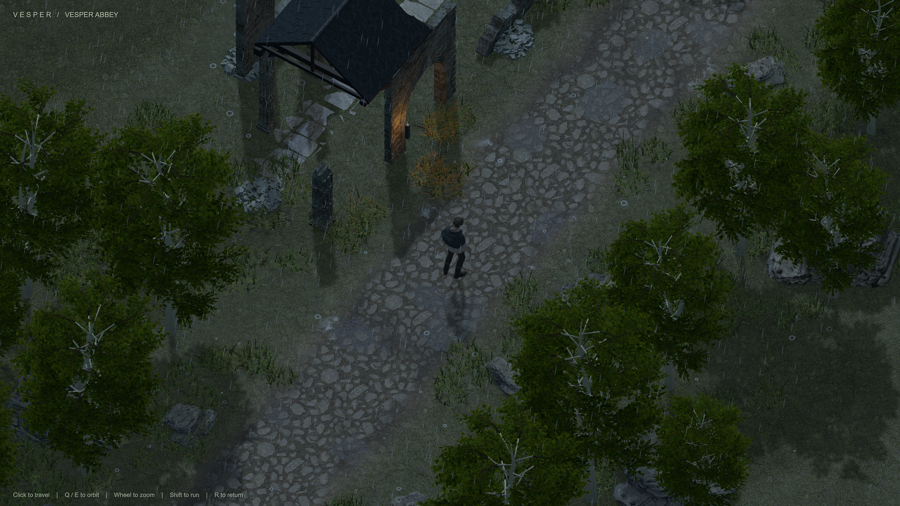

# VESPER — 개발 인수인계

현재 개발 기준은 **Weather World W10**입니다. 강가 → 어두운 숲 → 비 오는 폐허 → 밤 눈보라 설산을 걷는 Unity 데모이며, Q/E 시점 회전과 클릭 이동을 사용합니다. 음향은 없습니다.

**처음 받았다면 [HANDOFF.md](HANDOFF.md)를 먼저 읽으세요.** 최신 상태는 [CHECKPOINT.md](CHECKPOINT.md) 최상단, 조작은 [PLAY_WEATHER.md](PLAY_WEATHER.md), 기존 검증은 [W10 보고서](Migration/Evidence/Expansion/WeatherWorld/W10/REPORT.md)에 있습니다.

## Unity에서 이어서 작업하기

1. Git과 Git LFS를 설치하고 아래 명령으로 받습니다.

   ```sh
   git lfs install
   git clone https://github.com/seongjin971/gamedemo.git
   cd gamedemo
   git lfs pull
   ```

2. Unity Hub에서 **Unity 6000.5.7f1**과 Windows Build Support를 설치합니다.
3. Hub의 Add로 **`Unity/Vesper` 폴더**를 열고 패키지 설치 및 에셋 가져오기를 기다립니다.
4. **`Assets/Vesper/Scenes/Expansion/VesperWeatherWorld_W10.unity`**를 열고 Play를 누릅니다.

실행 파일은 저장소에 포함되지 않습니다. Windows 빌드 방법은 [HANDOFF.md](HANDOFF.md)에 있습니다. 기존 빌드 목록의 초기 장면을 그대로 빌드하면 W10이 실행되지 않으므로 장면을 직접 지정해야 합니다.

전체 Unity 소스·장면·메타데이터·자산, 제작 원본, 브라우저 데모, 상태 문서와 최신 W10 검증 자료를 포함합니다. 캐시·실행 빌드·과거 반복 캡처/녹화는 제외했습니다. 이 저장소는 2026-09-12 현재 파일의 전달용 스냅샷이며, 원본 PC의 과거 Git 이력은 별도로 보존되어 있습니다.



---

아래는 초기 브라우저 데모의 역사 설명입니다. Unity 개발 기준은 위의 W10과 HANDOFF.md이며, 아래 원본 요청의 시간·자산 제한은 후속 Unity 작업 조건이 아닙니다. 초기 태그와 `unity-migration` 브랜치는 원본 PC의 Git 이력을 가리키며 이 전달용 저장소에는 포함되지 않습니다.

## Preserved browser version

A live Three.js fantasy graphics demo made from the installed Dream Loop README's Example prompt. All models were authored locally in Blender or code. The slate texture and target reference were generated for this project; no stock models, textures, fonts, HDRIs, or other art assets were downloaded.

The browser version is preserved at Git tag `browser-baseline-2026-09-08` (`2413d5d`). The `unity-migration` branch adds a separate Unity URP comparison project in `Unity/Vesper`; see [Migration/README.md](Migration/README.md) for its scene, controls, evidence and remaining work. `preview.png` continues to show the browser baseline.

## Run

```sh
npm install
npm run dev
```

Open **http://127.0.0.1:5173/** in Chrome. The server binds to loopback only.

```sh
npm run build
npm run preview
node --test
```

## Controls

- **Click** the courtyard: the knight walks there, navigating around obstacles.
- **Drag**: orbit the camera. Vertical dragging changes elevation within limits.
- **Scroll**: zoom in or out.
- **R**: return character and camera to the initial view.
- **H**: hide/show the interface.
- **P** or **Capture**: save a rendered screenshot and measurements locally during development; download a PNG in a production preview.
- **D**: show/hide diagnostic measurements.
- **B**: run a development render-throughput benchmark (separate from display FPS).
- **N**: benchmark orbiting-camera render throughput during development.
- **V**: save cached-AO versus freshly rendered AO comparisons for small orbit, walk, and zoom changes during development.
- **U**: export the loaded scene geometry, transforms, materials and a matching comparison capture to the local evidence sink during development. This does not modify the Unity project automatically.

The camera follows the knight slowly. Movement stays inside a small courtyard even though the ruined city extends far beyond it. This is a visual demo with no combat, enemies, objectives, or progression.

## Source Example, verbatim

> Build me a graphics demo: isometric camera, voxel-ish art style with realistic shading and reflective wet floors, a character in an interesting scene. Fantasy setting (think Elden Ring, Diablo). Three.js in browser, >60fps. Don't download assets. Time limit of 1 hour. Controls: click to move the character, camera lazy-follows; drag to rotate camera; scroll to zoom in/out. No gameplay for now. World should feel alive: motion, animations, subtle environmental behaviors. Area around player should look expansive, but only allow movement in a limited space. No need to confirm the art with me or ask questions, just go!

Source: `C:/Users/brian/.codex/skills/dream-loop/README.md`, Example section.

## Rendering and assets

- Orthographic camera, physically based stone/metal/cloth, generated stone and bark surface maps, custom chipped masonry, real planar wet-floor reflections, warm animated firelight, restrained bloom, and SMAA.
- Locally authored knight, gnarled tree and fractured stone in `public/models/`.
- Animated gait and cloak, breathing/head motion, generated flame sprites with animated distortion, rising embers, floating rune rings, drifting dust/haze and wind in grasses.
- Thousands of stones use instancing; distant geometry is simplified and does not cast shadows onto the playable court.
- Source modeling scripts, `.blend` files, generation prompts, concept target, screenshots, diagnostics and independent visual verdicts are retained in the ignored `.dream-loop/` directory.
- The far city is a generated panoramic matte that scrolls with orbit; the playable courtyard, surrounding nearer ruins, tree, knight and reflections are real-time 3D.

The frame counter reports measured browser presentation cadence. It cannot exceed the connected display's refresh rate. See `VALIDATION.md` for the measured result and remaining visual differences; a numerical or automated result is not user visual acceptance.
